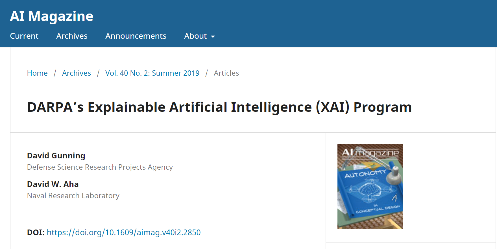
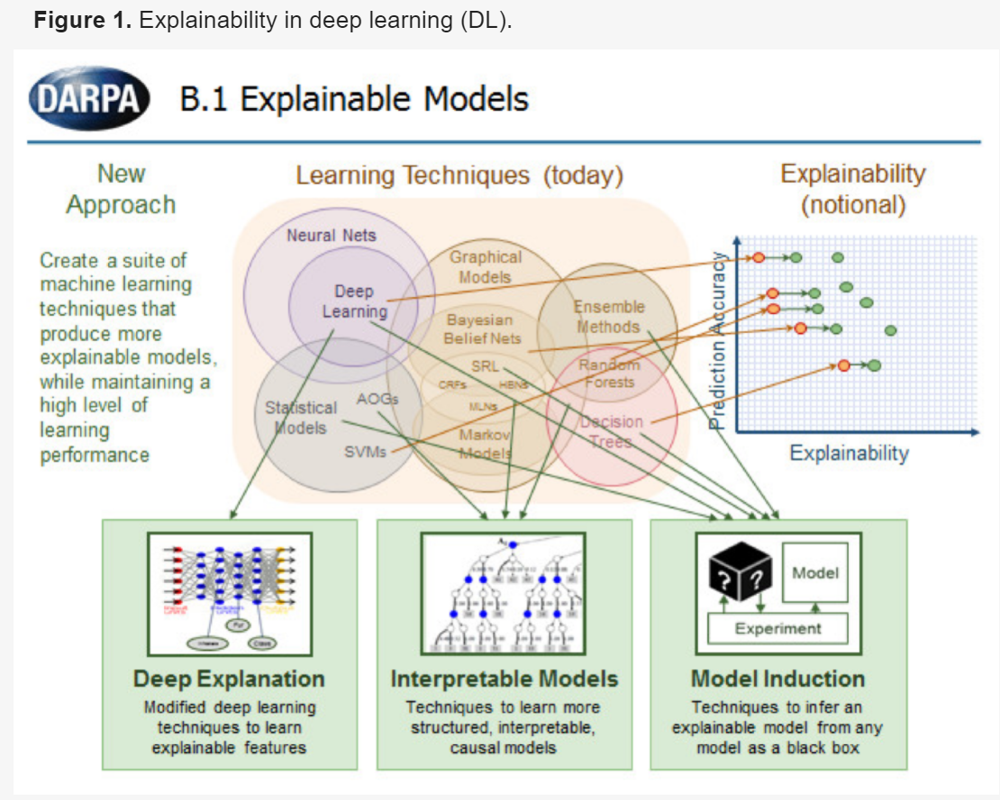
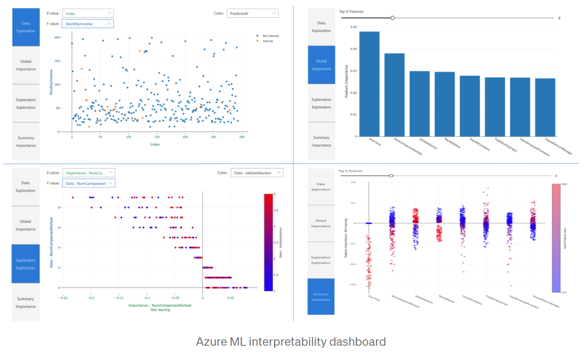
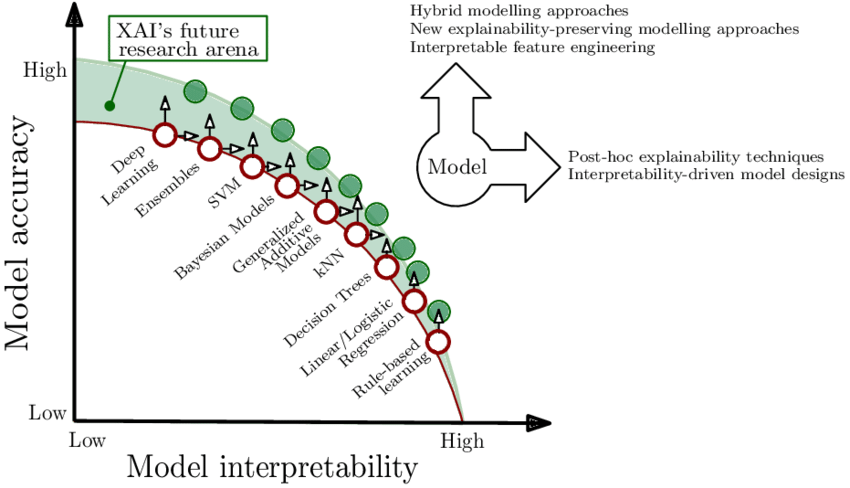
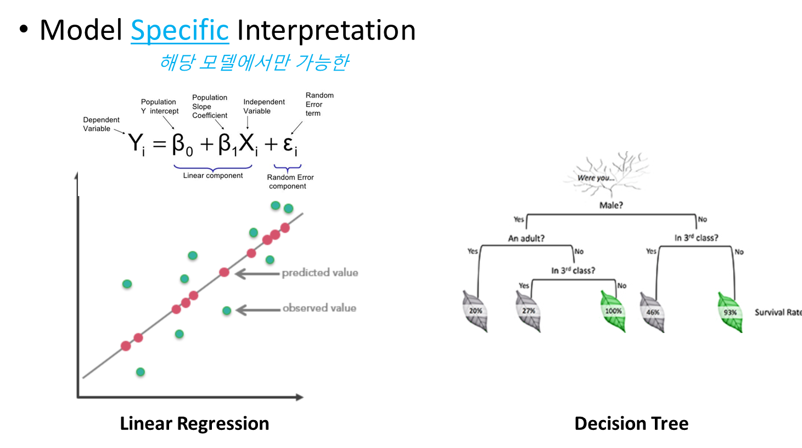
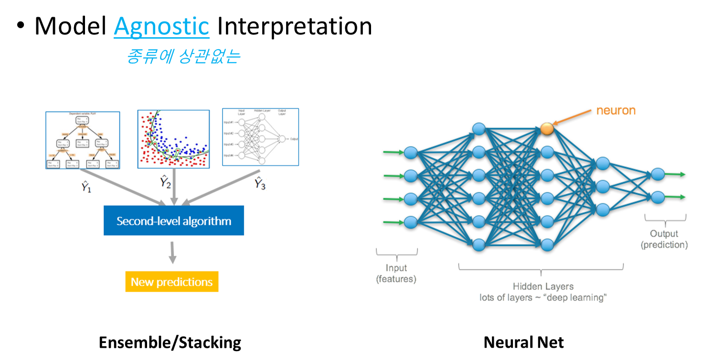

# Explainable Artificial Intelligence [XAI]
<b>XAI</b> - "설명 가능한 인공지능"
> - 1975년, '설명 가능한 의사 결정 체계'의 용어 등장, Shortliffe. Edward H., and Bruce G. Buchanan . "A model of inexact reasoning in medicine." Mathematical biosciences 23.3-4(1975)
> - 2004년, "XA"I 용어 등장, Michel van Lent, Willian Fisher and Michael Mancuso. "An explainable artificial intelligence system for small-unit tactical behavior.", Proceedings of the National Conference on Artificial Intelligence. Menlo Park, 2004 
> - 2016년, DARPA (Depense Advanced Research Projects Agency), Project BAA-16-53, Explainable Artificial Intelligence, XAI. (~Y21) : 참조 https://ojs.aaai.org/index.php/aimagazine/article/view/2850
> 

Accuracy 와 Explainability 의 Trade-Off 관계에 따라 실제 프로젝트에서 분석가들이 적용하는 알고리즘에 대한 고민이 깊어짐
DL 전용방법론, 어떠한 모델이든 훈련된 모델 자체를 해석하는 기법 그리고 어떠한 모델이든 훈련된 모델의 대안모델을 통해 해석하는 기법 중심으로 발전하고 있음.
> 

현재 State of The Art (SOTA)로 평가되는 것은 SHAP로 보이며 각종 platform에 이 기법이 장착되고 있는 추세.
아래는 MS-AZURE 경우이며 이 외 Python-Orange3 의 plug-in 으로 SHAP, Explain 이 이미 제작되어 있음.
> 

## Interpretability/explainability
- Explainability: possibility to explain from a technical point of view the prediction of an algorithm.
- Interpretability: the ability to explain or provide meaning in terms that are understandable by a human being.
- Transparency: a model is considered transparent if it is understandable on its own.

``` 
- Interpretability is the degree to which a human can understand the cause of a decision. 
- Another one is: Interpretability is the degree to which a human can consistently predict the model’s result.  
- The higher the interpretability of a machine learning model, the easier it is for someone to comprehend why certain decisions or predictions have been made.  
- A model is better interpretable than another model if its decisions are easier for a human to comprehend than decisions from the other model.   
- Christoph Molnar use the terms interpretable and explainable interchangeably like Miller (2017) But "Explanation" was used for explanations of individual predictions
- https://christophm.github.io/interpretable-ml-book/interpretability.html
```

---

## Model Specific Interpretation VS. Model Agnostic Interpretation
기존 모델자체를 해석하려는 방법, 그리고 이제 XAI 기법을 통한 범용모델 해석방법을 고찰해보자

### Accuracy VS. Explainablity
Trade-Off : To maximize performance, we use high-capability model. But it is hard to explain the result

- 데이터의 복잡도가 높아지며 Capacity가 높은 모델이 성능이 좋음. 그러나 설명하기는 더욱 힘들어짐.
- 설명을 위해 Capacity가 낮은 모델을 사용하는 경우 복잡한 데이터에 대한 성능이 저하되어 실적용히 힘듦어짐.
- Linear/Logistic Regression, Decision Tree, kNN 등이 대표적인 설명이 상대적으로 용이하나 복잡한 데이터에 대해 성능이 떨어지는 Model Specific Interpretation 영역에 속함

> 


---

### Model Specific Interpretation
> 

#### Linear Regression (이론적으로 해석이 가능)
- 상관계수(𝛽)를 ‘해석력’지표로서 간단히 참고가능
- t-statistic 등 고전통계기법으로 𝛽의 유의성 검증 가능
- 독립변수인 경우 인자별 민감도 (크기 및 (±)) 효과 및 종합 효과를 파악 가능
- 비선형관계 파악을 위해서는 x 에 대한 조작이 필요 
  - 독립변수화 (변수의 직교화, PCA 등)
  - Feature Engineering (선형화 등)

#### Decision Tree (설명이가능)
- 모델의 의사결정 과정을 자연스럽게 파악 가능
- 변수의 criteria에 따라 어떠한 결과에 도달하는지 직관적으로 파악
- 어떠한 변수가 지속적으로 중요변수인지 직관적인 파악

#### Tree Ensemble Models (해석은 가능하나 어려움)
- Random forest, Gradient Boosting tree
- 앞선 두 방법보다 복잡한 데이터에 대해서 좋은 성능을 냄
- Tree 분기 시 해당 변수의 평균적인 불순도 감소량을 통해 변수중요도로 파악
- 내부 Tree 별 Decision Tree Stucture를 활용한 설명방법이 존재하나 Tree별로 보기 힘든 부분이 존재


#### 대표적인 해석가능한 모델들의 아쉬운 점
- 모델별 해석방법이 해당 모델에 종속되어 있기에, 다른 모델간 비교가 어려움
- 설명하기 쉬운 모델일수록 성능이 아쉬운 경우가 많음. (성능 중심인 경우 설명이 어려움)

---

## Model Agnostic Interpretation
- 원래 모델을 Black-box 모델로 본다
  - White-box 모델에서 행하던 방식처럼 모델 내부 변수 및 계수에 접근하지 않음. (Model Specific - Linear 모델의 Beta 계수 및 상관관계 해석하지 않음)
  - 모델의 input을 조절하며 output을 고찰, output 이나 원래값과의 차이 변동에 대해서 해석
> 


#### Deep Neural Network (기존의 방법으로 해석 불가능)
- 사실상 Black-box 모델이며 해석하기 어려운 모델! 
- Attention, Class-Activation-Map 등 추가적인 구조를 통한 해석이 가능
  - 단, 추가적인 모델 구조 변경이 필요


#### 복합모델 Ensemble 및 Stacking (기존의 방법으로 해석 불가능)
- Ensemble 에 사용되는 단일 알고리즘 자체가 D/L, XGB 등의 해석이 힘들거나 불가능한 모델들로 구성되어 해석이 거의 불가능함! 

---

## Model-Agnostic Methods
하기 기술들과 용어들을 정리하면 아래 표와 같음. 상세부분은 각 기술들의 Link 참조
- Permutation Feature Importance (PFI)
- Partial Dependence Plot (PDP) and Individual Conditional Expectation (ICE)
- Local Interpretable Model-agnostic Explanations (LIME)
- SHAP (Shapley Additive explanations)
- FV and LRP (Filter Visualization and Layer Relevance Propagation)

```
- Agnostic : 모든 모델에 적용되는 ~
- Surrogate : 모든 모델에 적용될 수 있도록 대안모델을 만들어 해석하는 ~
- Local : 단일 instance (개별 데이터) 에 대해 설명가능한 ~
- Global : 모든 instance 에 대해 종합 설명가능한 ~
```
| Tech.Name | Model Dependency | Global/Local | NoteBook Example |
| :---         |     :---:      |          :---: |     :---:      |
| Feature Importance (FI)   | Specific     | Global    | [Example](pdp/notebook_exam/01_titanic/XAI_Example.html) |
| [Permutation FI (PFI)](pfi/01.Permutation_FI.md)  | Agnostic     | Global    | [Example](pdp/notebook_exam/01_titanic/XAI_Example.html) |
| [Partial Dependent Plot (PDP)](pdp/02.PDP_ICE.md)   | Agnostic     | Global    | [Example](pdp/notebook_exam/01_titanic/XAI_Example.html) |
| [Individual Conditional Expectation (ICE)](pdp/02.PDP_ICE.md)      | Agnostic       | Local     |  [Example](pdp/notebook_exam/01_titanic/XAI_Example.html) |
| [SHapley Additive exPlanations (SHAP)](shap/shap.md)     | Agnostic       | Local/Global      | [Example-Titanic](pdp/notebook_exam/01_titanic/XAI_Example.html)[Example-MNIST](https://github.com/sooeun67/xai/blob/main/shap/PyTorch_SHAP.ipynb) |
| [Local Interpretable Model Explanations (LIME)](lime/lime.md)     | Agnostic-Surrogate       | Local      | [Titanic Example](lime/titanic/titanic_lime.ipynb) / [MNIST example](lime/mnist/LIME_with_MNIST.ipynb)
| Layer-wise Relevance Propagation (LRP)     | DL Agnostic     | Local      | [MNIST example](lrp/LRP_mnist.ipynb)

[Example](pdp/notebook_exam/01_titanic/XAI_Example.ipynb)

---
## 참고 
- [서적] XAI 설명가능한 인공지능, 인공지능을 해부하다, 안재현, 위키복스, 2020
- [서적/WEB] Explainable AI 기법에 대한 Global/Local Review <https://christophm.github.io/interpretable-ml-book/>
- [WEB] 전반적인 AI 기법에 대한 이론적 설명 - dmqa.korea.ac.kr
- [WEB] PDP/ICE - https://scikit-learn.org/stable/modules/partial_dependence.html#
- [WEB] LIME https://github.com/marcotcr/lime
- [WEB] SHAP https://github.com/slundberg/shap
- [WEB] States of the ART tech. [https://paperswithcode.com/sota]
- [WEB] XAI 설명 및 최근동향 https://medium.com/swlh/push-the-limits-of-explainability-an-ultimate-guide-to-shap-library-a110af566a02
- [Journal] Explainable Artificial Intelligence (XAI): Concepts, Taxonomies, Opportunities and Challenges toward Responsible AI,  Arrieta, 2019 https://arxiv.org/pdf/1910.10045.pdf


