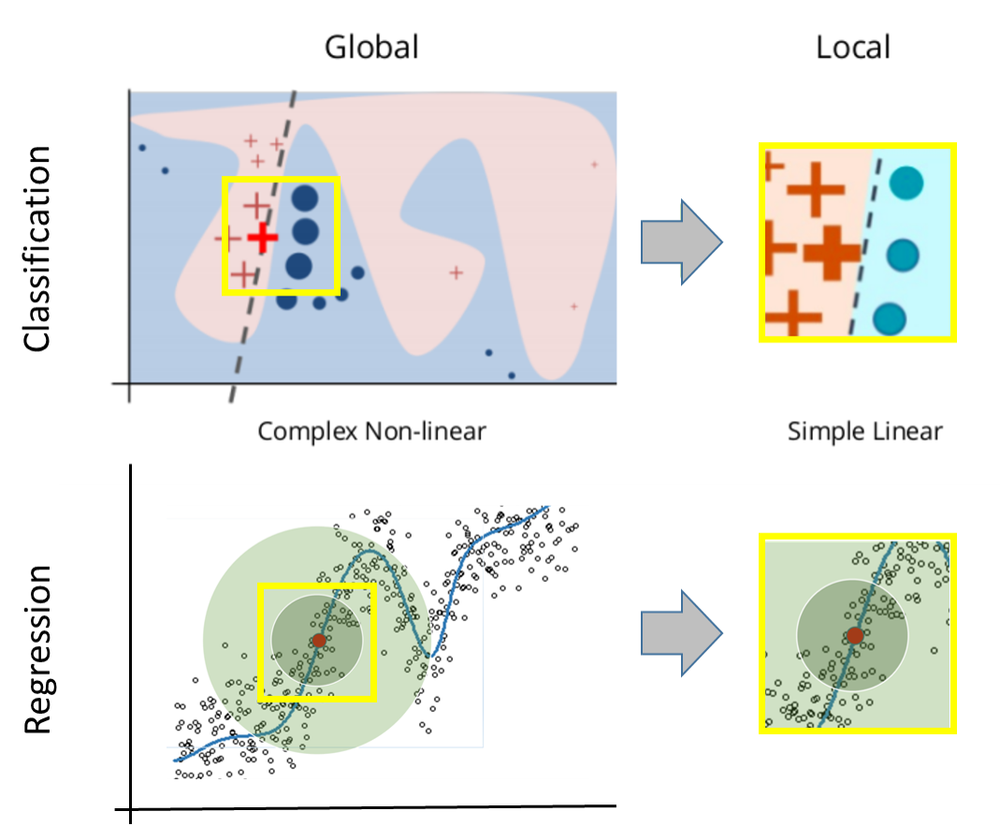
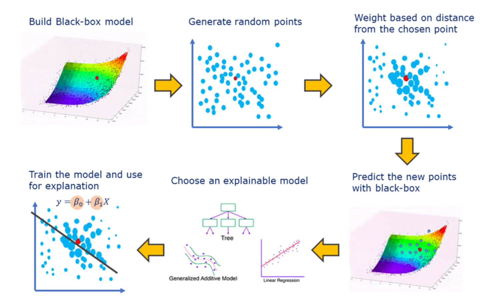
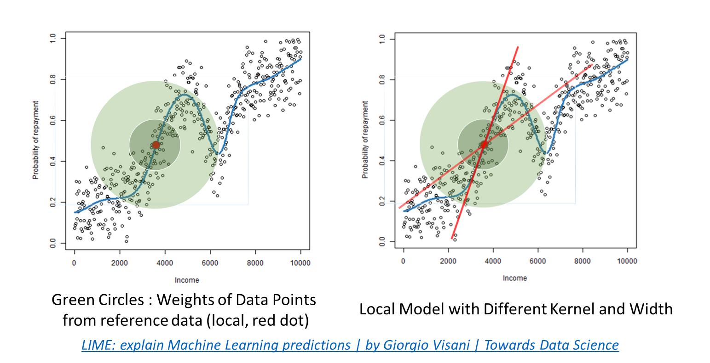

## [LIME](https://github.com/marcotcr/lime) (Local Interpretable Model-agnostic Explanation)
시작하기 앞서, Global Surrogate Analysis에 대해 언급해보자.
- 우리는 복잡한 전역모델을 해석하기 힘들 때 때로는 단순한 전역모델을 사용하기도 함
- 단순한 전역모델 (Linear/Logistic Regression, Decision Tree 등)을 통해 모델의 Feature Importance나 X인자별 민감도를 파악하여 X-Y 관계성에 대한 이해를 높이고 훈련된 복잡한 모델을 debugging 하는 용도로 사용하기도 하였음.
- 그러나 이를 Local로 좁혀 data instance 하나에 대해 적용하는 것이 거의 불가능함 (적용은 가능하나 해석이 적용될 수 없음)

#### 대리분석 (Surrogate Analysis)
>본래 기능을 흉내내는 간단한 대체재를 만들어 prototype이 동작하는지 판단하는 분석기법
	>

>다시 말해, 블랙 박스 모델 f 가 존재하고, f를 흉내 내는 해석 가능한 ML 모델 g 를 만드는 것이 대리 분석의 목표. 
>모델 f 가 SVM을 사용해 학습한 모델이라면 모델 g 는 트리나 linear regression 일 수도 있다. 
>모델 g의 결정 조건은 (1) f 보다 학습하기 쉽고 (2) 설명 가능하며 (3) 모델 f 를 유사하게 흉내낼 수 있으면 된다

>- **장점**:
>	- model-agnostic: 어떠한 모델이든 이를 블랙박스로 취급하여 학습 가능
>	- 적은 학습 데이터도 사용가능
>	- 모델이 바뀌더라도 feature 만 같다면 대리 분석 수행 가능

##### 로컬 대리분석 (Local Surrogate)
데이터 하나에 대해 원래 모델인 블랙박스 모델이 분류한 결과를 해부하고 해석하는 과정을 분석하는 기법으로 대표적으로 **LIME** 과 **SHAP-kernalExplainer** 이 있다

---

### Concepts
- 국소적인 영역 (Local Data) 으로 scale을 좁혀보면, 우리는 이것들이 간단한 선형으로 설명할 수 있을 것이라는 생각을 해왔을 것.
- 즉, local 에 대해 설명 가능한 간단한 모델(Surrogate Model) 을 적용하여 local 에 대한 설명성을 확보할 수 있지 않을까?
	> 

---

### Calculation
설명해야할 local 데이터 근처의 다른 data들을 original 모델(f(X))를 사용하여 준비하고, 이를 여러가지 단순한 모델알고리즘(G)에 적합하여 최소의 오차를 갖는 모델을 결정함.
이 때 최소의 오차는 사용한 단순한 모델 알고리즘(g)와 orignal 모델 (f)의 오차를 최소화하고, g의 complexity 를 최소화하는것으로 결정됨

LIME Algorithm (Overall)
- Provie Original Trained ML model(f(X)) and a reference point(x) to be explained
- Generate points all over the ℝᵖ space (sample X values from a Normal distribution inferred from the training set, Pertubation)
- Predict the Y coordinate of the sampled points, using the ML model (the generated points are guaranteed to perfectly lie on the ML surface)
- Assign weights (π(x)) based on the closeness to the chosen point (use RBF Kernel, it assigns higher weights to points closer to the reference)
- Train simple model(g(X)) in simple model group (G) on the generated weighted dataset: g(X) : E(Y) = β₀ + ∑ βⱼ Xⱼ. The β coefficients are regarded as LIME explanation

	> 

---

#### for Image Data-SET

- LIME 은 input data 에 대해 부분적으로 변화(permutation)를 준다
- 40명의 얼굴을 학습한 후, 어떤 인풋 이미지가 들어왔을 때 40명 중 한 명을 구분하는 모델이 있다고 가정하자. 
	- 이때 어떤 이미지 x 가 모델 입력값으로 들어온다면 LIME은 입력 이미지에 대해 아래와 같이 pixel단위보다 큰 해석가능 인식 단위로 분할(Segmentation,X')함. 이를 Super-Pixel이라 함
		

	- n개의 X'를 선택한 Z'점 생성 (uniform하게 pertubation)
	- Z'를 본래 X' 공간으로 투영하여 Local Sample x 와의 거리기반으로 Weight선정 (π(x)), 본래 모델(fx)에 입력하여 Y예측값 산출
	- 이렇게 준비된 Z'점 (super-Pixel 각각을 사용하냐마냐 (0,1)을 X인자로 하는 simple 모델에 학습준비)
	- 𝑔(𝑥′)=𝑤1∗𝑥1′+⋯+𝑤i∗𝑥i'+⋯+𝑤n∗𝑥n′ ,𝑤𝑖:𝑆𝑢𝑝𝑒𝑟𝑃𝑖𝑥𝑒𝑙 𝑖의가중치 , 𝑥𝑖:𝑆𝑢𝑝𝑒𝑟𝑃𝑖𝑥𝑒𝑙 i를 사용하는지(1) 사용하지 않는지(0) 로 모델학습
	- w 가 큰 순서대로 superpixel을 mapping하면 x 를 설명하는 영역의 가중치를 표현가능
		> 
---

### Advantage and Dis-advantages
- Advantage
	- model-agnostic: 어떠한 모델이든 이를 블랙박스로 취급하여 학습 가능
	- Deep Learning 이나 GPU 사용하지 않고 적용 가능한, 가벼운 XAI 기법
	- matrix 로 표현 가능한 데이터(text/image)에도 작동하는 기법

- Dis-advantages
	- **불확실성**: ***non-deterministic*** (even for the same input, algoirthm can exhibit different behaviors/output)
		- local 데이터의 주변 선정 (이웃 데이터 정의), 이웃 데이터에 대한 가중치, 이미지의 경우 슈퍼 픽셀 알고리즘에 따라 마스킹 데이터가 달라지며, 이웃 데이터에 대한 pertubation이 기본적으로 포함되어 있음. 모델 g는 sampling 위치에 따라 random한 결과를 보일 수 있다
	> 
	- 데이터 하나에 대한 설명이기 때문에 모델 전체에 대한 일관성을 보전하지 못한다 (Global 에 대해 적용이 되지 않음)
	> **Note:** [논문](https://arxiv.org/pdf/1602.04938.pdf)에서 SP-LIME(서브모듈러 최적화) 알고리즘을 통해 데이터 셋 전체를 대표하는  예시들을 뽑아 신뢰가 갈만한 모델을 만드는 기법 소개

---

### 샘플 
- Data: 뉴스 기사와 해당 기사의 20가지의 카테고리
- 아래는 LIME 출력 결과물
--  88-89와 SE 모델이 자동차(auto) 카테고리를 결정하는 서브모듈러(highlighted)
	> 

-------
#### Reference (참고문헌)
- [Paper] LIME : https://arxiv.org/pdf/1602.04938.pdf
- [서적] XAI 설명가능한 인공지능 도서
- [Web] https://velog.io/@tobigs_xai/1%EC%A3%BC%EC%B0%A8-LIME-%EB%85%BC%EB%AC%B8-%EB%A6%AC%EB%B7%B0-Why-Should-I-Trust-You-Explaining-the-Predictions-of-Any-Classifier
- [Web] https://yjjo.tistory.com/3#:~:text=SP%2DLIME%3A%20%EB%AA%A8%ED%98%95%20%EC%A0%84%EC%B2%B4%EC%9D%98,%EB%A5%BC%20%EC%84%A0%ED%83%9D%ED%95%B4%EC%A3%BC%EB%8A%94%20%EC%95%8C%EA%B3%A0%EB%A6%AC%EC%A6%98%EC%9E%85%EB%8B%88%EB%8B%A4.
- [Web] LIME: explain Machine Learning predictions | by Giorgio Visani | Towards Data Science

