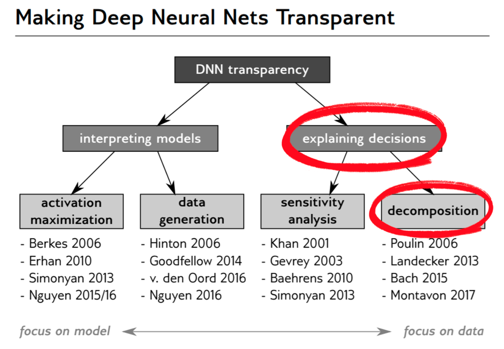
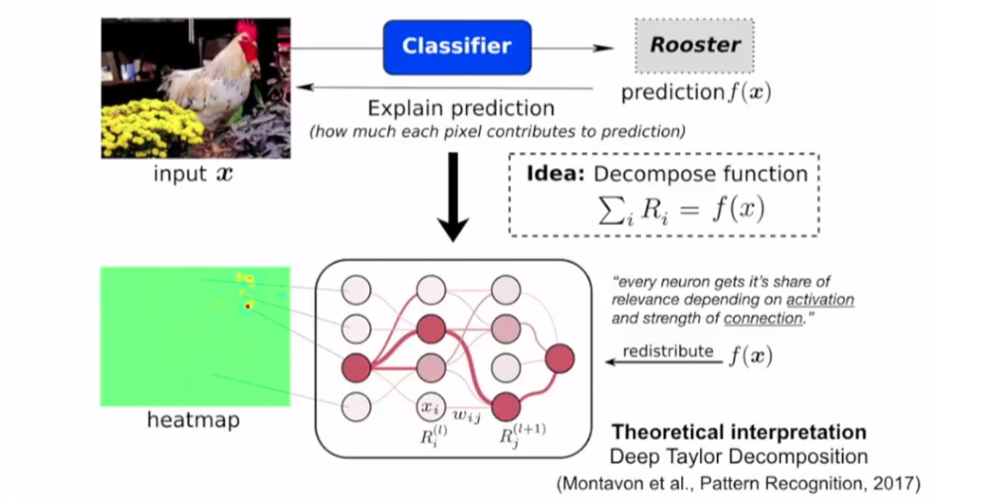
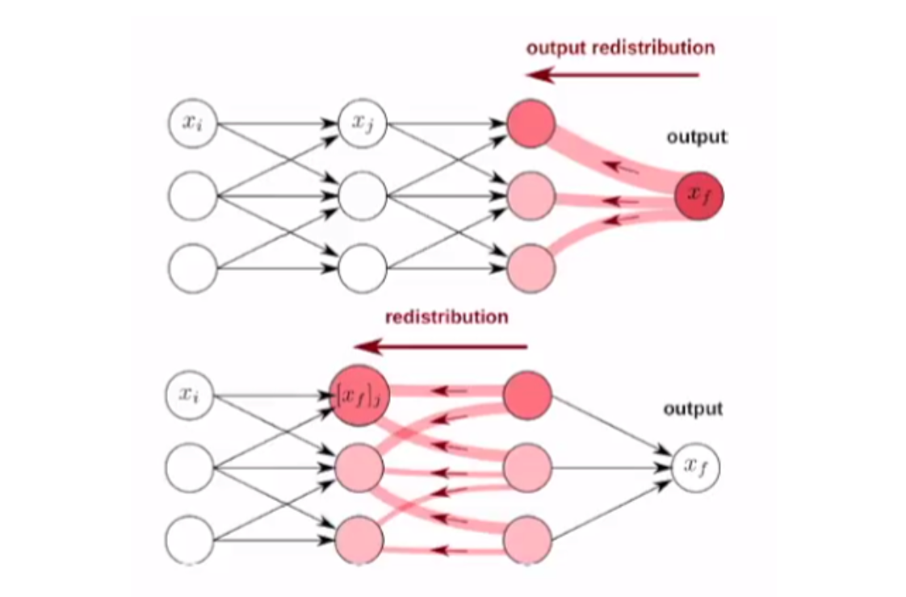
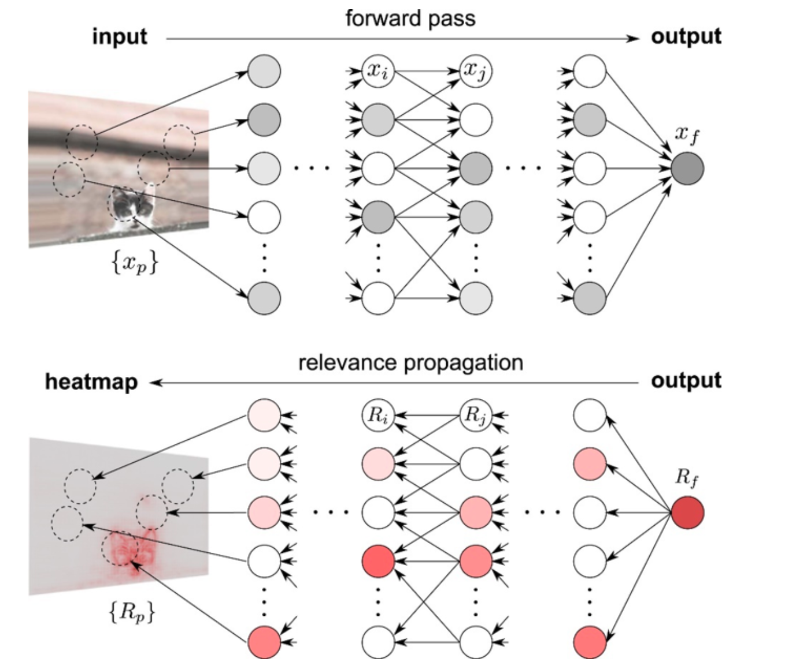

# [LRP](Layer-wise Relevance Propagation)

**L** ayer-wise    **(레이어 단위)** *로*  
**R** elevance    *결과에 영향을 주는 **(관련성)** 을 구하는*  
**P** ropagation  *역 **(전파)** 기술*  

즉, 입력 데이터 관점에서 **분류 결과** 뿐만 아니라 **결정에 영향** 을 미치는 구조를 설명

---

## 1. Introduction 

  

- 뉴럴네트워크의 동작을 이해하기 위한 연구들은 크게 두 종류로 나눌 수 있다. 
- 첫 번째는 **모델 자체를 해석하는 방법** 이고, 두 번째는 **‘왜 그런 결정을 내렸는지’ 파악하는 방법** 이다.
- Layer-wise Relevance Propagation (이하 LRP)는 두 번째 종류인 ‘왜 그런 결정을 내렸는지’ 파악하는 방법에 속하며, 그 중에서도 decomposition을 이용한 방법이다.

---

## 2. How?

- 잘 훈련된 네트워크에 input(x):수탉 사진/ouput(f(x)):'수탉'이 경우, 이 '수탉'이라는 출력 f(x)를 얻기 위해 입력 샘플의 각 pixel들이 기여하는 바를 계산하는 방법
- 아래의 그림1에서 보이는 것처럼 heatmap이라고 적힌 그림에 pixel들의 기여도(relevance score)가 색깔로 표시되며, 수탉의 부리나 머리 등을 보고 해당 입력의 클래스가 '수탉'임을 출력했다는 것을 알 수 있다.

---

### LRP의 기본적인 가정 및 작동 방식

  

LRP(Layer-wise Relevance Propagation)의 이름에서 볼 수 있듯이 이 method는 relevance score를 출력단에서 입력단 방향으로 top-down 방식으로 기여도를 재분배 하는 방법이다.
 
~~~
## 각 뉴런은 어느 정도의 기여도(certain relevance)를 갖고 있다.
## 기여도는 top-down 방식으로 각 뉴런의 출력단에서 입력단 방향으로 재분배 된다.
## (재)분배시 기여도는 보존된다.
  - 예를 들어 그림 1에서와 같이 특정 사진 입력에 대해 ‘수탉’이라는 분류를 했고 그 출력값 f(x)가 0.9였다고 하자.
  그러면 각 layer의 뉴런들은 0.9라는 출력에 대한 기여도를 모두 조금씩은 갖고 있으며,
  relevance score를 분배한 후 각 layer에서의 relevance score의 합은 0.9가 되어야 한다는 뜻이다.
~~~

### Backpropagation?
- 사전적 의미로 역전파는 일맥상통하겠으나 일반적인 D/L 용어 Backpropagation 와 구분할 필요는 있다.
- gradient를 이용한다는 점과 출력단에서 입력단으로 거꾸로 계산해간다는 점은 비슷하지만, LRP의 목적은 전혀 다르다.
- 가장 큰 차이점은 back propagation은 뉴럴넷 학습을 위해 사용되고, LRP는 학습 완료된 뉴럴넷에 적용한다는 점이다.
- 그 목적에 맞추어 back propagation은 d(Error)/d(weight) 를 역으로 계산하고, LRP 는 d(Y)/d(x) 를 역으로 계산한다는 점 또한 차이가 존재함.
- LRP는 back propagation 처럼 relevance score를 최적화하기 위한 값이 아니다.

---

### Calculate relevance score with Taylor series
- Relevance score : x가 출력에 얼마나 영향을 주는가? -> x의 변화가 y의 변화에 얼마나 큰 변화를 주는것인가? -> y에 대한 x의 기여도(relevance score) 

- Talyer Series 의 f(a) = 0 이 되는 a를 찾는 방법들과 Activation Relu가 아닌 상황에서 Talyer 2차이상 항들에 대한 보정방법등 다양한 방법들 존재

---

## 3. Conclusion

---

### Advantages and Dis-Advantages
- 장점
  - 비교적 직관적
  - CNN/RNN 등 다양한 네트워크에 사용가능
  - Pixel-Wise로 GAP layer 사용하는 CAM에 비해 좋은 해상력

- 단점
  - 기여도의 해석일 뿐 설명이 되려면 추가적인 맥락이 요구됨. 일일이 히트맵으로 기여도를 보고 객체를 인식해야 한다는 번거로움
  - 출력에 가까운 은닉층일수록 히트맵으로 나타난 추상적 개념은 해석이 어려움
  
---

### sample
- https://lrpserver.hhi.fraunhofer.de/handwriting-classification

---

## Appendix : [FV] (Filter Visualization)

### Filter

- 필터는 원본 이미지에서 특정 요소를 추출하기 위해 사용하는 것으로, 주파수 필터을 함.
- 다섯번 째 그림은 저주파만 통과하기 때문에 블러리한 이미지를 결과로 얻으며, 세번째 그림인 Laplace Filter는 Edge를 찾는 역할. 네번째 그림인 high-pass filter는 이미지가 선명해지는 결과를 얻음.
- **즉, 학습된 CNN 필터들은 이런식으로 경계선을 찾거나 블러리한 면을 찾는 등 다양한 주파수 필터의 기능을 한다.**
- **피처맵 시각화 방식으로, 모델이 입력 이미지에 어떻게 반응하는지 조사하는 방법**

---

### Occlusion Experiment(Zeiler & Fergus 2013)

- 위 그림은 image의 *어떤 부분이 이미지 분류에 큰 영향*을 미치는지 알아본 결과
- 방법: (a)와 같은 input image가 있을 때, 작은 회색 상자를 그리고,모델에 통과시켜서 나온 결과를 기록 -> 이 회색상자를 조금씩 이동시키면서 위 과정을 반복 
- 결과: 결과를 heatmap으로 시각화한 것이 (d), (e)로, (d)는 회색상자로 일부가 지워진 그림이 포메라니안일 확률이 높으면 빨간색이고, 낮으면 파란색
- 즉, 파란색으로 부분이 지워지면 포메라니안으로 분류될 확률이 낮으므로 이 부분이 분류 결과를 결정하는 중요한 부분임을 암시함. Input image에서 파란 부분은 강아지의 얼굴
- 결론: 본 실험은 CNN이 사람이 물체를 인식하는 과정과 유사하다는 것을 검증

---

### CAM visualization(2016)
- 학습한 네트워크가 이미지를 개라고 판별할 때와 고양이라고 판별할 때, 각각 이미지에서 중요하게 생각하는 영역은 다를 것. 이를 시각화해주는 알고리즘이 바로 Class Activation Map (CAM) 관련 알고리즘들입니다. CNN 모델이 어느 곳을 보고 있는지를 알려주는 weak supervised learning 알고리즘 (CAM, Grad-CAM)
  - 단, CAM의 경우 Global Average Pooling Layer가 존재해야하는 단점 존재하며 마지막 filter를 지난 최종 image 해상도로 heat-map이 형성되는 (저해상도) 단점 존재

---

### Advantages and Dis-advantages
- Dis-advantages
  - 깊은 은닉 계층일수록 해석력이 떨어짐
  - 해석자마다 해석 방법이 다를 수 있음
  
---

### References
- [Paper] [LRP 논문: On Pixel-Wise Explanations for Non-Linear Classifier Decisions by Layer-Wise Relevance Propagation, Sebastian Bach, (2015)](https://journals.plos.org/plosone/article?id=10.1371/journal.pone.0130140)
- [WEB] LRP Overview https://angeloyeo.github.io/2019/08/17/Layerwise_Relevance_Propagation.html
- [WEB] LRP에 대한 설명 https://github.com/OpenXAIProject/PyConKorea2019-Tutorials
- [Journal] http://iphome.hhi.de/samek/pdf/MonXAI19.pdf
- [WEB] CAM, GradCAM 설명 https://tyami.github.io/deep%20learning/CNN-visualization-Grad-CAM/, https://prgmti1.tistory.com/32
