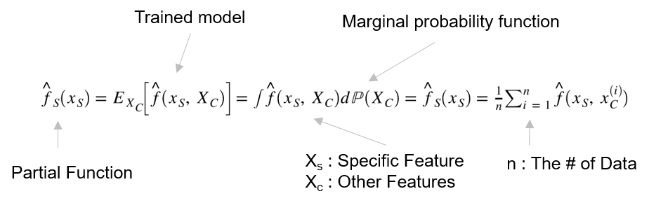
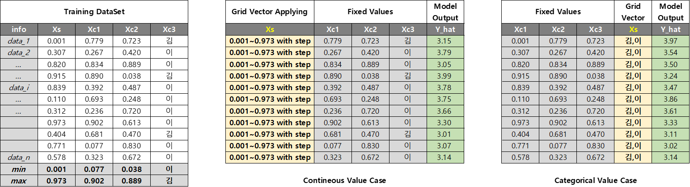
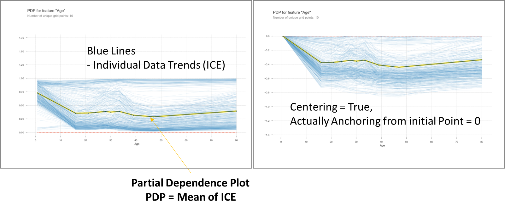

# Introductions for Partial Dependence Plot (PDP) | Individual Conditional Expectation (ICE) | Accumulated Local Effects (ALE)

  ## The partial dependence plot
  - The partial dependence plot (PDP or PD plot) shows the marginal effect one or two features have on the predicted outcome of a machine learning model (J. H. Friedman 2001)
  - Intuition : 모델 생성 후, 관심있는 X인자 값 변화에 따른 모델의 결과를 출력하자. 다른 X인자는 고정하여 관심X인자만의 효과를 살펴보자
  
    ---
    
    ### Marginal Distribution (https://en.wikipedia.org/wiki/Marginal_distribution)
    - 각 변수들의 구간별 확률값을 더하자 (Marginalizing)
    - 응용하여 Regression 은 관심있는 X인자의 구간별 Y값의 평균값을 사용
    - Classificaiton이 경우 관심있는 X인자의 구간별 Y_probability값의 평균값을 사용
    

    ---
  
    ### Partial Dependency Function
    
    >

    - The PDP shows the marginal effect one or two features have on the predicted outcome
    - The PDP is a global method
      - The method considers all instances
      - Gives a statement about the global relationship of a feature with the predicted coutcome.

    - The relationship between the target and a feature can be easily seen
      - Linear : Linear model show Linear relationship
      - Monotonic
      - more complex : Usually tree based model show 
    ---
    
    ### Actual Calculations
    > Grid Calculation for Xs
    > 
    > Keep the other Xc values for individual i'th data
    > 
    > Get Model Output (Y_hat) using Xs grids and same Xc values for i'th data
    > 
    > Get Y_hat mean value for each Xs value
    > 
      
      
    ---
    ### Advantages / Dis-Advantages
    - Advantages
      - The computation of PDP is intuitive: The PDF at a particular feature value represents the average prediction
      - If the feature for PDP is not correlated, then the PDP perfectly represent the relationship and the interpretations is clear
      - If we intervene on a feature and meature the changes in the prediction, the PDP could have a causal interpretation
      - Easy to implement

    - Disadvantages
      - The realistic maximum number of features in a partial dependence function is two (due to Human's ability)
      - Some PDP do not show the feature distribution: cause misleading
      - The assumption of independence: Accumulated Local Effect (ALE) Plots
      - Heterogeneous effects might be hidden:Individual conditional expectation curves
    
    ---
    ### Appendix
    - Python Library Information
      - sklearn include pdp
    - References
      -  https://christophm.github.io/interpretable-ml-book/pdp.html
      -  Book "XAI 설명가능한 인공지능, 인공지능을 해부하다, 안재현, 위키북스, 2020"
      -  https://scikit-learn.org/stable/auto_examples/inspection/plot_partial_dependence.html
      - 

#### Jupyter-Notebook Example

---

## Individual Conditional Expectation (ICE)

### Partial Dependency Function 을 구성하는 개별 요소
  - 각 관측치별 Xs의 변화에 따른 모델결과를 포현 (다른 X가 변하지 않는다는 가정)
  - 개별 관측치들의 변화와 PDP를 통한 전체 결과를 종합적으로 고찰할 수 있으며 개별 관측치들의 패턴을 파악하기 용이
  - Model-Agnostic-Local에 해당

### Actual Calculation
  > ![image]images/ice_calc.png)

  > 

### Advantages / Dis-Advantages
- Advantages
  - 직관적으로 전체 경향과 Local 경향을 비교
  - 개별데이터의 패턴 파악 가능 (증가그룹, 감소그룹이 반반이여서 PDP 는 almost 0가 되는 극단적 경우가 좋은 예제)
- Dis-Advantages     
  - 변수들이 독립적이라는 가정을 지니고 있음 (그렇지 않은 경우, 모델은 이미 관계성 존재하는 X들로 학습된 상태)
    - 실제 Xs Grid 값에 따른 모델출력값이 가능하나 실데이터는 공간상에 없는 경우가 존재하며 외삽의 경우가 되어 신뢰도 감소
    - Xs 와 다른 X가 controllable 한 변수가 아닌 경우, 에러를 발생시킴
  - 상기 단점은 PDP도 동일함.
      
---
## Implementation Tech. in ML projects
- SKE Smart Pricing Project (2019~2021), 최, 조, 선, 김, 곽
- SKGC Virtual R&D Lab Project (2019~2021), 조, 선, 송, 박, 김, 곽      
- 상기 projects 에서 X인자들의 종속성 문제를 극복한 새로운 방식의 ICE 를 사용하여 모델 적용함.
