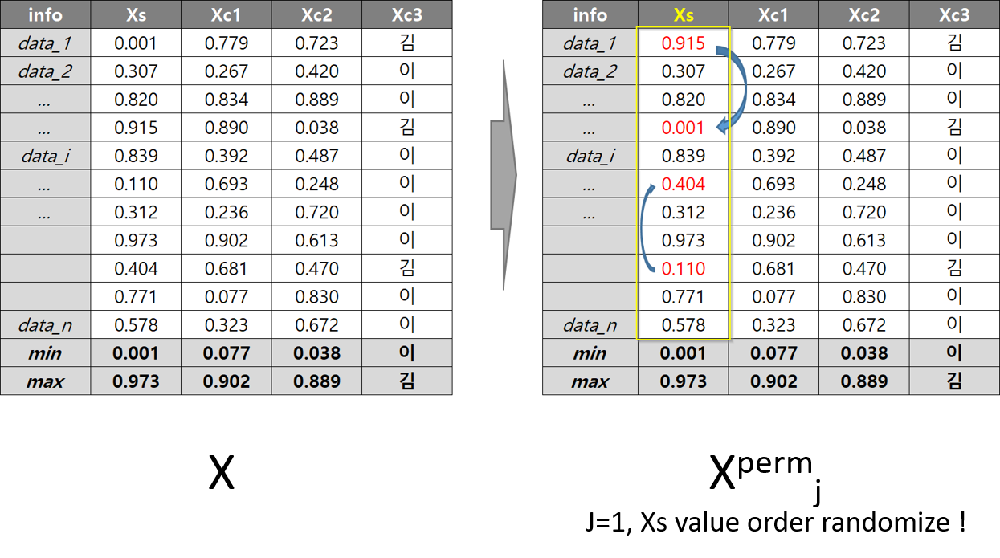
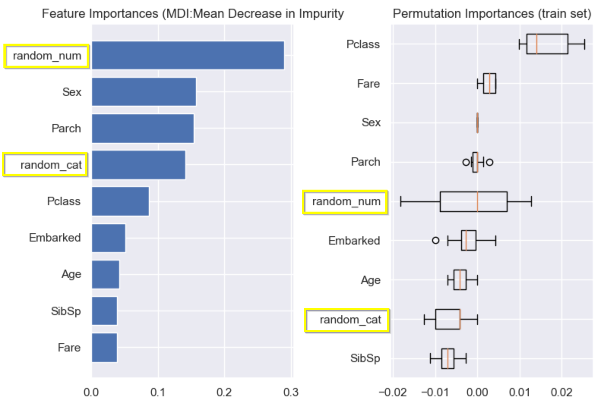

# Permutation Feature Importance (PFI)
<b>Model-Agnostic-Methods</b> : Permutation feature importance is a model inspection technique that can be used for any fitted estimator when the data is tabular. 
This is especially useful for non-linear or opaque estimators. 

> - PFI is defined to be the decrease in a model score when a single feature value is randomly shuffled. 
> - This procedure breaks the relationship between the feature and the target, thus the drop in the model score is indicative of how much the model depends on the feature. 
> - This technique benefits from being model agnostic and can be calculated many times with different permutations of the feature.

```
Note : Features that are deemed of low importance for a bad model could be very important for a good model. 
Therefore it is always important to evaluate the predictive power of a model prior to computing importances.
Permutation importance does not reflect to the intrinsic predictive value of a feature by itself 
but how important this feature is for a particular model.
```

---

## Calculation
> - 데이터 행렬 𝑋(= 𝑛 * 𝑝)로 사전학습된 모델 𝑓 가 있을 때 (데이터 n개, 특성치 p개) 
> - Permutation, j: 확인하고자 하는 특성치(j열)을 순서만을 shuffle한 새 데이터 행렬 𝑋 𝑝𝑒𝑟𝑚 생성
> - Base 성능과의 차이를 Feature importance(𝐹𝐼(𝑗))로 사용. (𝑗 = 1,2, . . , 𝑝 에 대해 개별 시행)
> - ex) "Person A"를 뺐더니 일이 안 돌아가는구나..Person A 가 얼마나 중요한가

> 

---

## Permutation Importance vs Mean Decrease in Impurity (MDI)
The impurity-based feature importance ranks the numerical features to be the most important features. 
As a result, the non-predictive random_num variable is ranked the most important!

> This problem stems from two limitations of impurity-based feature importances:
> - impurity-based importances are biased towards high cardinality features;
> - impurity-based importances are computed on training set statistics 
>   and therefore do not reflect the ability of feature to be useful to make predictions that generalize to the test set (when the model has enough capacity).

### Examples : <titanic Data> - Extra Tree Model
> Feature Importance - Random variables occupied very high position. Due to two limitations, described above
> This example shows how to use Permutation Importances as an alternative that can mitigate those limitations.

>
  
---
  
## Advantages and Dis-advantages of Permutation Importance
### Advantages
> 1. 직관적인 해석이 가능하고 기존 Feature Importance의 제한점 극복 (Random 변수를 참고치로 사용가능)
> 2. Model-Agnostic 방법으로 어떤 모델이든 적용이 가능함
> 3. Test Sample에 대한 적용이 가능
  
### Dis-advantages
> 1. Low Calculation Performance compared with FI (MDI)
> 2. Still global interpretation (No local interpretation)
> 3. Still No Y impact direction indications 


## References:
[1] L. Breiman, “Random Forests”, Machine Learning, 45(1), 5-32, https://doi.org/10.1023/A:1010933404324
  
[2] https://scikit-learn.org/stable/auto_examples/inspection/plot_permutation_importance.html
  
[3] https://scikit-learn.org/stable/modules/permutation_importance.html
